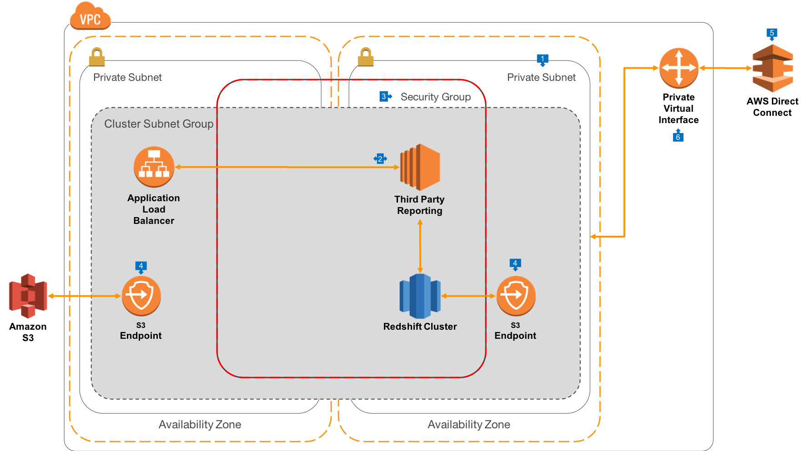

# Redshift cluster architecture to support private connections

## Overview
This is perhaps the most common deployment architecture for Redshift clusters - deployed within private subnets in VPC that are only accessible over private, leased lines, through [DirectConnect](https://aws.amazon.com/directconnect). Use this architecture when you want:

* Connections only from your office or corporate data centre
* The ability to require encrypted connections to all resources in your VPC

## Walkthrough of the Architecture

1. As with the architecture that uses Public Routing, we'll build this architecture on the AWS [Amazon Virtual Private Cloud (VPC)](https://aws.amazon.com/vpc), but instead of using Public Subnets, this VPC will only have Private Subnets. Also, as with public routing, we'll create a [Cluster Subnet Group](https://docs.aws.amazon.com/redshift/latest/mgmt/working-with-cluster-subnet-groups.html) that spans AZ's to facilitate cluster restores and high availability.
2. Also similar to the Public Routing architecture, third-party reporting tools will be created within the private subnets where the Redshift clusters can be deployed. However, in this model, the Application Load Balancers aren't in public subnets, but also in the same private subnets. This gives a convenient way for clients to connect to the third-party servers, as well as supporting upgrades to new versions etc.
3. As with the Public Routing architecture, the Redshift Cluster and third-party reporting tools are in the same VPC Security Group. This architecture can also support Bastion/RDP hosts for administration, but are omitted for simplicity
4. Redshift clusters that perform COPY/UNLOAD can access Amazon S3 via an [S3 Gateway Endpoint](https://docs.aws.amazon.com/AmazonVPC/latest/UserGuide/vpc-endpoints.html) which exposes S3 within your VPC without requiring an Internet Gateway. In this configuration, [turn on 'Enhanced VPC Routing'](https://docs.aws.amazon.com/redshift/latest/mgmt/enhanced-vpc-working-with-endpoints.html) within your Redshift cluster configuration.
5. This architecture is designed secure connections to Redshift that come from only authorised endpoints on the other side of a private connection. Amazon [DirectConnect](https://aws.amazon.com/directconnect) is provisioned in this environment, and provides 1 and 10Gbit connections over private leased lines, directly into AWS Regions. In this model, you may also wish to [build hardware based VPN](https://aws.amazon.com/premiumsupport/knowledge-center/create-vpn-direct-connect/) tunnels over the DirectConnect.
6. Once the DirectConnect connection is in place, it can be exposed to one or more VPC's via [Private Virtual Interfaces (VIF)](https://docs.aws.amazon.com/directconnect/latest/UserGuide/WorkingWithVirtualInterfaces.html). This VIF is configured to allow routing into all Private Subnets in the VPC, which will enable end user customers in corporate offices, or applications in a corporate data centre, to connect directly to Redshift or third-party reporting servers.